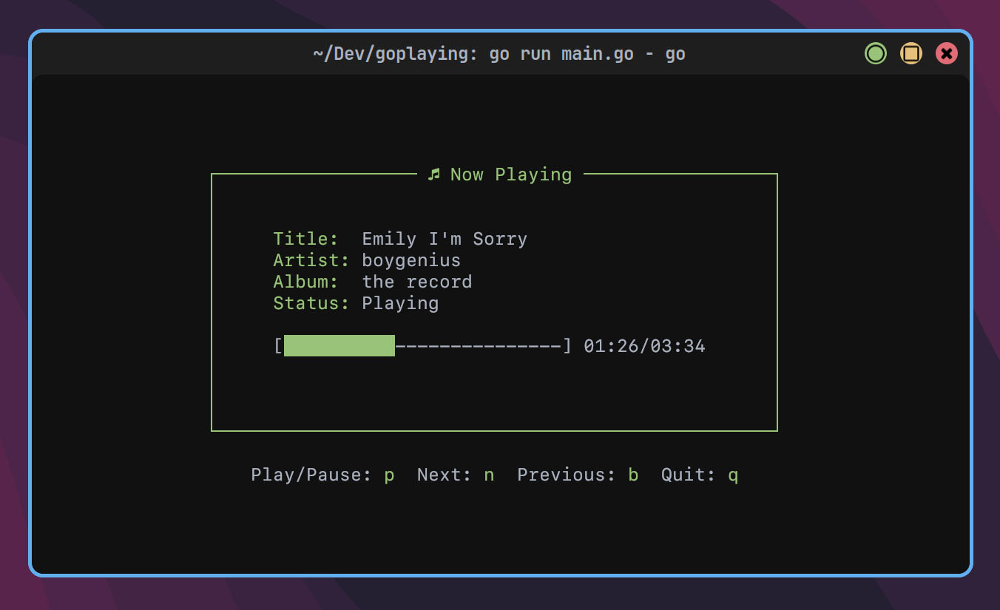

# GoPlaying

## Description

This is a basic Now Playing TUI written in Go. I wanted a simple way to see what was playing on my Spotify account without having to open the app. This is a simple solution that uses playerctl to get the currently playing song and display it in the terminal. It even gives you basic controls to play/pause, skip, and go back.



## Installation

### Arch Linux

You can install GoPlaying from the AUR with the package `goplaying-git`.
```bash
yay -S goplaying-git
```

### Manual

### Dependencies

- [go]
- [playerctl]

1. Clone the repository
2. Run `go build`
3. Run `./GoPlaying`

## Usage

The controls are basic vim controls:
- `p` - Play/Pause
- `n` - Next
- `b` - Previous
- `q` - Quit

## License

This project is licensed under the MIT License - see the [LICENSE](LICENSE) file for details.
